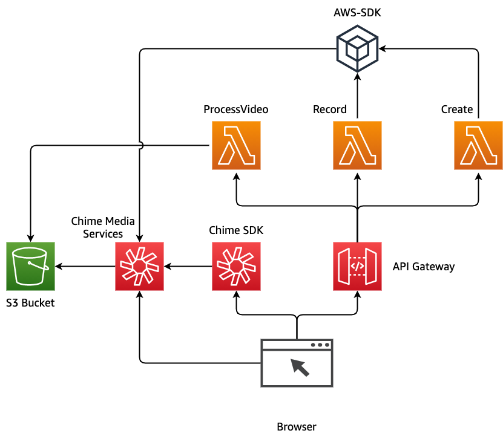

# Amazon Chime Meeting SDK Media Capture Demo

This demo will build and configure several services within AWS so that you can capture the media of a meeting to an S3 bucket and then process that output into a complete video file.
## Overview



## Requirements
- node V12+ [installed](https://nodejs.org/en/download/)
- npm [installed](https://www.npmjs.com/get-npm)
- yarn [installed](https://yarnpkg.com/getting-started/install)
- pip [installed](https://pip.pypa.io/en/stable/installing/)
- jq [installed](https://stedolan.github.io/jq/download/)
- AWS CLI [installed](https://docs.aws.amazon.com/cli/latest/userguide/install-cliv2.html)
- AWS CDK [installed](https://docs.aws.amazon.com/cdk/latest/guide/getting_started.html#getting_started_install)
  - `npm install -g aws-cdk`
  - Be sure to have the latest version installed.  If you need to upgrade, uninstall with `npm uninstall -g aws-cdk` and then reinstall.
- AWS CDK [bootstrapped](https://docs.aws.amazon.com/cdk/latest/guide/bootstrapping.html)
  - `cdk bootstrap`
- Deployment must be done in us-east-1

## Resources Created
- S3 Bucket - Used for storage of the captured media as well as the processed media
- Create Lambda - Used to create the meeting and join users to the Chime SDK Meeting.  
- Record Lambda - Used to start and stop the media capture pipeline.
- Process Lambda - Used after the recording has stopped to process the video from separate chunks into a single mp4 file.
- API Gateway - Used to trigger Lambdas from the client side browser
- SDK Layer - Used by the Create and Record Lambdas to have access to Chime APIs that are not currently available in Lambda
- Python Layer - Used by the Process Lambda to assist with ffmpeg
- FFMPEG Layer - Used by Process Lambda to concat files together.  Static build of FFmpeg/FFprobe for Amazon Linux 2. Bundles FFmpeg 4.1.3. Deployed from [serverlessrepo](https://serverlessrepo.aws.amazon.com/applications/us-east-1/145266761615/ffmpeg-lambda-layer)
## Deployment

### Back-end Resources
- Clone this repo: `git clone ENTER_REPO_NAME`
- `cd REPO_NAME`
- `chmod +x deploy.sh`
- `./deploy.sh`
- Accept prompts for CDK deployment

### Local client
- `cd client`
- `yarn`
- `yarn start`


### Cloud9 Deployment Instructions
```
nvm install 12
sudo yum install jq
npm install -g aws-cdk
npm install -g yarn
./deploy.sh
cd client
yarn
yarn run start
```


## Description

This demo will assist you in seeing a Chime SDK Meeting media capture pipeline in action.  It uses a simple React based client to create a meeting and then start a media capture pipeline of that meeting.  This pipeline will take chunks of media in 5 second increments and store them in an S3 bucket.  Once the recording has been stopped, a separate API call will trigger the Process Lambda and concatenate the separate files together into a single, playable media file.  

This demo relies on ffmpeg for concatenating the files together.  An ffmpeg layer based on [John Van Sickle's static build](https://johnvansickle.com/ffmpeg/) is deployed as part of this deployment.  For licensing [information](http://ffmpeg.org/legal.html).

## Using the Demo

After successfully deploying the CDK components, navigate to the client directory `cd client` and start the local server with `yarn start`.  This will allow you to start a Chime SDK Meeting at `http://localhost:3000/` 


To start a meeting, enter a title in Meeting Title and click Submit.  This client can be run in multiple tabs to have multiple participants joined to the same meeting if the same title is used.  Click `Start Video` to enable local video being sent and then `Start Recording` to begin start the media capture pipeline.  Once completed, press `Stop Recording` and the process video lambda will be triggered to create the concattenated media file.  


## Cleanup

To clean up this demo: `cdk destroy`.  Additionally, the ffmpeg layer that was created will need to be removed.  The S3 bucket that is created will be emptied and destroyed as part of this destroy so if you wish to keep the media files, they should be moved.  

