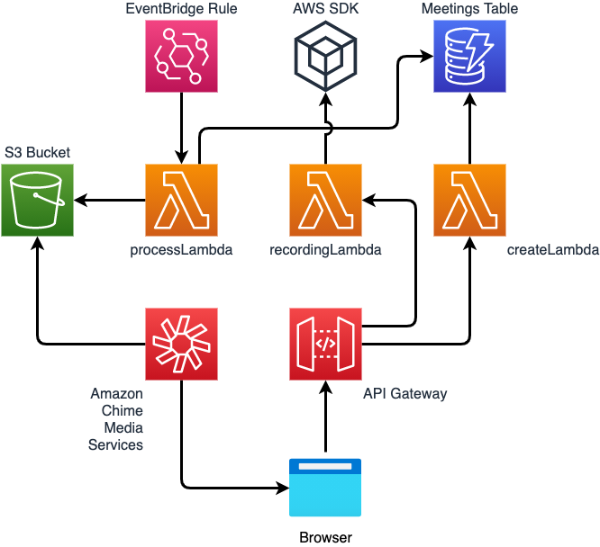
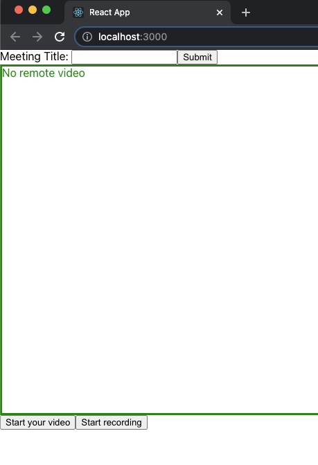

# Amazon Chime Meeting SDK Media Capture Demo

This demo is a variation of the main branch for media capture demo. This particular demo stitches audio files together in .mp4 format and meeting events together in .txt format. The source of these files is from the Amazon Chime SDK Media Capture bucket in S3.

## Overview



## Requirements

- node V12+ [installed](https://nodejs.org/en/download/)
- npm [installed](https://www.npmjs.com/get-npm)
- jq [installed](https://stedolan.github.io/jq/download/)
- yarn [installed](https://yarnpkg.com/getting-started/install)
- AWS CLI [installed](https://docs.aws.amazon.com/cli/latest/userguide/install-cliv2.html)
- Docker [installed](https://docs.docker.com/get-docker/)
- Deployment _must_ be done in us-east-1

## Resources Created

- S3 Bucket - Used for storage of the captured media as well as the processed media
- Meetings Table - DynamoDB used to store meeting and attendee information
- Create Lambda - Used to create the meeting and join users to the Chime SDK Meeting.
- Record Lambda - Used to start and stop the media capture pipeline.
- Process Lambda - Containerized image used after the recording has stopped to process the video from separate chunks into a single mp4 file.
- API Gateway - Used to trigger Lambdas from the client side browser
- EventBridge Rule - Rule used to trigger Process Lambda when Media Capture Pipeline is deleted.

## Deployment

### Back-end Resources

- Clone this repo: `git clone https://github.com/aws-samples/amazon-chime-media-capture-pipeline-demo`
- `cd amazon-chime-media-capture-pipeline-demo`
- `./deploy.sh`
- Accept prompts for CDK deployment
- Deployment will automatically be done in us-east-1. More information regarding region usage With Chime SDK and media pipelines can be found [here](https://docs.aws.amazon.com/chime/latest/dg/sdk-available-regions.html)

### Local client

- `cd client`
- `yarn`
- `yarn start`

### Cloud9 Deployment Instructions

Resize Cloud9 Instance with script [here](https://docs.aws.amazon.com/cloud9/latest/user-guide/move-environment.html).

```
nvm install 16
npm install -g yarn
sudo yum install jq
./deploy.sh
cd client
yarn
yarn run start
```

## Description

This demo will assist you in seeing a Chime SDK Meeting media capture pipeline in action. It uses a simple React based client to create a meeting and then start a media capture pipeline of that meeting. This pipeline will take chunks of media in 5 second increments and store them in an S3 bucket. Once the recording has been stopped, a separate API call will trigger the Process Lambda and concatenate the separate files together into a single, playable media file.

This demo relies on ffmpeg for concatenating the files together. An Docker image is created that uses [John Van Sickle's static build](https://johnvansickle.com/ffmpeg/) and is deployed as part of this deployment. For licensing [information](http://ffmpeg.org/legal.html).

## Using the Demo

After successfully deploying the CDK components, navigate to the client directory `cd client` and start the local server with `yarn start`. This will allow you to start a Chime SDK Meeting at `http://localhost:3000/`


To start a meeting, enter a title in Meeting Title and click Submit. This client can be run in multiple tabs to have multiple participants joined to the same meeting if the same title is used. Click `Start Video` to enable local video being sent and then `Start Recording` to begin start the media capture pipeline. Once completed, press `Stop Recording` and the process video lambda will be triggered to create
the concattenated media file.

## How It Works

Once the recording has stopped, an EventBridge pattern will match:

```
{
  "detail-type": ["Chime Media Pipeline State Change"],
  "source": ["aws.chime"],
  "detail": {
    "eventType": ["chime:MediaPipelineDeleted"]
  }
}
```

This pattern will match a rule to trigger the processLambda.

The processLambda will list objects in the media capture S3 bucket matching the meetingId sent in the event trigger. If the account being used is configured to capture Active Speaker + Audio, the audio and video files will be stored in the audio/ prefix. These will be mp4 files with both audio and video. The processLambda will concatenate these files together into a single mp4 output file with both audio and video.

If the account being used is configured to capture all attendees and audio, audio files will be stored in the audio/ prefix and each attendee's video will be stored in the video/ prefix with the attendeeId used as part of the file name. The processLambda will concatenate the audio component from the audio/ prefix and each of the attendee components from the video/ prefix in to separate files. If there are two attendees in the meeting, a total of three files will be created:

1. the composite audio file
2. the video file of the first attendee
3. the video file of the second attendee

## Cleanup

To clean up this demo: `cdk destroy`. The S3 bucket that is created will be emptied and destroyed as part of this destroy so if you wish to keep the media files, they should be moved.
