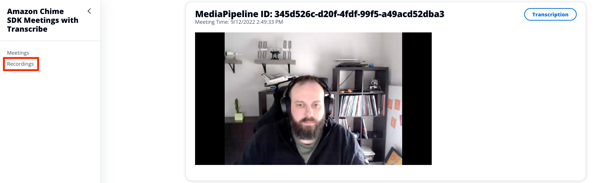

# Amazon Chime SDK Meetings with Transcribe and Media Capture Pipelines

Amazon Chime SDK Meetings consist of two different components that work together to add real-time voice and video to an application. These components can be broken down into front end and back end components. The front end uses the Amazon Chime SDK while the back end uses the AWS SDK. This distinction will be important to understand how these two components work together.

At the most basic level, AWS SDK is used to create and manage Amazon Chime SDK Meetings and the Amazon Chime SDK client libraries are used within the client application to connect to this meeting. In this demo, we will be deploying an AWS Cloud Development Kit (CDK) that uses these components to create a simple Amazon Chime SDK Meeting between two participants. Additionally, this meeting will use [Amazon Transcribe](https://aws.amazon.com/transcribe/) and [Amazon Chime SDK Media Pipelines](https://docs.aws.amazon.com/chime-sdk/latest/dg/media-pipelines.html) to create a transcription and recording of this meeting. Let's see how that works.


## Backend

We will be using the [AWS SDK for Javascript v3](https://docs.aws.amazon.com/AWSJavaScriptSDK/v3/latest/clients/client-chime-sdk-meetings/index.html) in the backend for five AWS SDK calls: [`CreateMeetingCommand`](https://docs.aws.amazon.com/AWSJavaScriptSDK/v3/latest/clients/client-chime-sdk-meetings/classes/createmeetingcommand.html), [`CreateAttendeeCommand`](https://docs.aws.amazon.com/AWSJavaScriptSDK/v3/latest/clients/client-chime-sdk-meetings/classes/createattendeecommand.html). [`StartMeetingTranscriptionCommand`](https://docs.aws.amazon.com/AWSJavaScriptSDK/v3/latest/clients/client-chime-sdk-meetings/classes/startmeetingtranscriptioncommand.html), [`CreateMediaCapturePipelineCommand`](https://docs.aws.amazon.com/AWSJavaScriptSDK/v3/latest/clients/client-chime/classes/createmediacapturepipelinecommand.html), and [`CreateMediaConcatenationPipelineCommand`](https://docs.aws.amazon.com/AWSJavaScriptSDK/v3/latest/clients/client-chime-sdk-media-pipelines/classes/createmediaconcatenationpipelinecommand.html)

`CreateMeetingCommand`, `CreateAttendeeCommand`, `StartMeetingTranscriptionCommand`, and `CreateMediaCapturePipelineCommand` will be used in the [meetingInfo.ts](src/resources/meetingInfo/meetingInfo.ts) AWS Lambda function that is triggered by an API POST from the client. `CreateMediaConcatenationPipelineCommand` will be used in [`eventBridge.ts`](src/resources/eventBridge/eventBridge.ts) that is triggered by [Amazon EventBridge](https://aws.amazon.com/eventbridge/). We will look at these in more depth later.

### Create Meeting

```typescript
var createMeetingCommandInput: CreateMeetingCommandInput = {
  ClientRequestToken: '',
  ExternalMeetingId: '',
  MediaRegion: 'us-east-1',
};

async function createMeeting() {
  console.log('Creating Meeting');
  createMeetingCommandInput.ClientRequestToken = randomUUID();
  createMeetingCommandInput.ExternalMeetingId = randomUUID();
  try {
    const meetingInfo: CreateMeetingCommandOutput = await chimeSdkMeetings.send(
      new CreateMeetingCommand(createMeetingCommandInput),
    );
    console.info(`Meeting Info: ${JSON.stringify(meetingInfo)}`);
    return meetingInfo;
  } catch (err) {
    console.info(`Error: ${err}`);
    return false;
  }
}
```

This function in the [meetingInfo](src/resources/meetingInfo/meetingInfo.ts) Lambda function is called when a new meeting is needed. This particular code will create an Amazon Chime SDK meeting in `us-east-1` with a random `ClientRequestToken` and `ExternalMeetingId`.

The output of this command will look something like this:

```json
{
  "Meeting": {
    "ExternalMeetingId": "12345",
    "MediaPlacement": {
      "AudioFallbackUrl": "wss://haxrp.m2.ue1.app.chime.aws:443/calls/4101582d-72d2-451b-8ac0-f0f127992713",
      "AudioHostUrl": "d1535c0577976b27a01ae5a034c9ca7c.k.m2.ue1.app.chime.aws:3478",
      "EventIngestionUrl": "https://data.svc.ue1.ingest.chime.aws/v1/client-events",
      "ScreenDataUrl": "wss://bitpw.m2.ue1.app.chime.aws:443/v2/screen/4101582d-72d2-451b-8ac0-f0f127992713",
      "ScreenSharingUrl": "wss://bitpw.m2.ue1.app.chime.aws:443/v2/screen/4101582d-72d2-451b-8ac0-f0f127992713",
      "ScreenViewingUrl": "wss://bitpw.m2.ue1.app.chime.aws:443/ws/connect?passcode=null&viewer_uuid=null&X-BitHub-Call-Id=4101582d-72d2-451b-8ac0-f0f127992713",
      "SignalingUrl": "wss://signal.m2.ue1.app.chime.aws/control/4101582d-72d2-451b-8ac0-f0f127992713",
      "TurnControlUrl": "https://2713.cell.us-east-1.meetings.chime.aws/v2/turn_sessions"
    },
    "MediaRegion": "us-east-1",
    "MeetingArn": "arn:aws:chime:us-east-1:112233445566:meeting/4101582d-72d2-451b-8ac0-f0f127992713",
    "MeetingFeatures": null,
    "MeetingHostId": null,
    "MeetingId": "4101582d-72d2-451b-8ac0-f0f127992713",
    "PrimaryMeetingId": null,
    "TenantIds": []
  }
}
```

This information is needed by the client libraries to connect to the Amazon Chime SDK meeting and will be used there. For now, we will package this information and prepare to return it to the client making the request.

### Create Attendee

Using this information, we will create an attendee for this meeting.

```typescript
var createAttendeeCommandInput: CreateAttendeeCommandInput = {
  MeetingId: '',
  ExternalUserId: '',
};

async function createAttendee(meetingId: string, attendeeEmail: string) {
  console.log(`Creating Attendee for Meeting: ${meetingId}`);
  createAttendeeCommandInput.MeetingId = meetingId;
  createAttendeeCommandInput.ExternalUserId = attendeeEmail;
  const attendeeInfo: CreateAttendeeCommandOutput = await chimeSdkMeetings.send(
    new CreateAttendeeCommand(createAttendeeCommandInput),
  );
  return attendeeInfo;
}
```

This function will create an attendee using the previously created Amazon Chime SDK meetingId and an ExternalUserId based on the email address that was captured from [Amazon Cognito](https://aws.amazon.com/cognito/) and passed from the UI to the Lambda function through the API Gateway.

The output of this command will look something like this:

```json
{
  "Attendee": {
    "AttendeeId": "690bd42d-1632-8c92-bb52-54557eabafa0",
    "Capabilities": {
      "Audio": "SendReceive",
      "Content": "SendReceive",
      "Video": "SendReceive"
    },
    "ExternalUserId": "user@example.com",
    "JoinToken": "NjkwYmQ0MmQtMTYzMi04YzkyLWJiNTItNTQ1NTdlYWJhZmEwOjdhYmRkYjljLTkyODUtNDA4NC1hNTJiLWVlMjJhODNhYTU5Mg"
  }
}
```

### Start Transcription

Once the Amazon Chime SDK meeting has been created, we will use the meetingId to start transcription.

```typescript
async function startTranscribe(meetingId: string) {
  try {
    const transcribeResponse = await chimeSdkMeetings.send(
      new StartMeetingTranscriptionCommand({
        MeetingId: meetingId,
        TranscriptionConfiguration: {
          EngineTranscribeSettings: {
            LanguageCode: 'en-US',
          },
        },
      }),
    );
    console.log(JSON.stringify(transcribeResponse));
    return true;
  } catch (error) {
    return false;
  }
}
```

This will cause attendees in the meeting to have their audio transcribed and returned to all participants in the Amazon Chime SDK meeting through the data plane. These transcriptions will also be captured in the media capture pipeline.


### Start Media Capture Pipeline

To start the media capture pipeline, we will use the meetingId returned from `CreateMeetingCommand`.

```typescript
async function startCapture(meetingId: string) {
  const createPipelineParams: CreateMediaCapturePipelineCommandInput = {
    ChimeSdkMeetingConfiguration: {
      ArtifactsConfiguration: {
        Audio: { MuxType: 'AudioOnly' },
        CompositedVideo: {
          GridViewConfiguration: {
            ContentShareLayout: 'PresenterOnly',
          },
          Layout: 'GridView',
          Resolution: 'FHD',
        },
        Content: { State: 'Disabled' },
        Video: { State: 'Disabled' },
      },
    },
    SinkArn: captureBucketArn,
    SinkType: 'S3Bucket',
    SourceArn: `arn:aws:chime::${awsAccountId}:meeting:${meetingId}`,
    SourceType: 'ChimeSdkMeeting',
    Tags: [{ Key: 'transcription-for-comprehend', Value: 'true' }],
  };
  console.log(JSON.stringify(createPipelineParams));
  try {
    const createMediaCapturePipelineResponse: CreateMediaCapturePipelineCommandOutput =
      await chimeSdkMediaPipelinesClient.send(
        new CreateMediaCapturePipelineCommand(createPipelineParams),
      );
    return createMediaCapturePipelineResponse.MediaCapturePipeline
      ?.MediaPipelineArn;
  } catch (error) {
    console.log(error);
    return false;
  }
}
```

In addition to the `SinkArn` that will direct the capture to our capture bucket, we also configure the [artifacts to be captured](https://docs.aws.amazon.com/chime/latest/APIReference/API_ArtifactsConfiguration.html). The `Tag` included will direct the media capture pipeline to capture a slimmed down version of the transcription that will not require us to parse the transcription output to create a human readable file.

### Create Meeting Summary


```typescript
if (attendeeInfo && attendeeInfo.Attendee) {
  joinInfo = {
    Meeting: meetingInfo.Meeting,
    Attendee: [attendeeInfo.Attendee],
  };
  const responseInfo = {
    Meeting: meetingInfo.Meeting,
    Attendee: attendeeInfo.Attendee,
  };

  await startTranscribe(meetingInfo.Meeting.MeetingId);
  const mediaCapturePipelineArn = await startCapture(
    meetingInfo.Meeting.MeetingId,
  );
  if (mediaCapturePipelineArn) {
    await putMeetingInfo(joinInfo);
    response.statusCode = 200;
    response.body = JSON.stringify(responseInfo);
    console.info('joinInfo: ' + JSON.stringify(response));
    return response;
  }
}
```

To summarize what we have done so far:

1. Create Meeting
2. Create Attendee
3. Start Transcription (with meetingId from Create Meeting)
4. Start Media Capture Pipeline (with meetingId from Create Meeting)

Using the Meeting information and Attendee information, we will package them into a JSON object and return them to the requesting client.

## Frontend

In this demo, the frontend client is a simple React App that will make the API request and render the results.

### Join Button

```javascript
const JoinButtonProps = {
  icon: <Meeting />,
  onClick: (event) => handleJoin(event),
  label: 'Join',
};

const handleJoin = async (event) => {
  event.preventDefault();
  const email = (await Auth.currentUserInfo()).attributes.email;
  console.log(email);
  try {
    const joinResponse = await API.post('meetingApi', 'meeting', {
      body: { email: email },
    });
    const meetingSessionConfiguration = new MeetingSessionConfiguration(
      joinResponse.Meeting,
      joinResponse.Attendee,
    );

    const options = {
      deviceLabels: DeviceLabels.AudioAndVideo,
    };

    await meetingManager.join(meetingSessionConfiguration, options);
    await meetingManager.start();
    meetingManager.invokeDeviceProvider(DeviceLabels.AudioAndVideo);
    setMeetingId(joinResponse.Meeting.MeetingId);
    setAttendeeId(joinResponse.Attendee.AttendeeId);
  } catch (err) {
    console.log(err);
  }
};
```

When the Join button is clicked in [Meeting.js](site/src/Meeting.js), the `handleJoin` function will be called and the email address of the Cognito user is passed to the AWS Lambda function. This information will be used to create the meeting and attendee and will return the `joinInfo` response. This response is used with [`meetingManager`](https://aws.github.io/amazon-chime-sdk-component-library-react/?path=/story/sdk-providers-meetingmanager--page) to join and start the meeting session. Once joined and started, this client will be able to view and send audio and video using the configured `DeviceLabels`.

### Video Tiles

To render the meeting session video tiles, we will use [`VideoTileGrid`](https://aws.github.io/amazon-chime-sdk-component-library-react/?path=/docs/sdk-components-videotilegrid--page). This will create a responsive grid layout of the two attendees.

### Receive Transcriptions

In order to receive transcriptions, we will use [`subscribeToTranscriptEvent`](https://aws.github.io/amazon-chime-sdk-js/interfaces/transcriptioncontroller.html#subscribetotranscriptevent) on the [`useAudioVideo`](https://aws.github.io/amazon-chime-sdk-component-library-react/?path=/story/sdk-hooks-useaudiovideo--page) hook.

```javascript
useEffect(() => {
  if (audioVideo) {
    audioVideo.transcriptionController?.subscribeToTranscriptEvent(
      (transcriptEvent) => {
        setTranscripts(transcriptEvent);
      },
    );
  }
}, [audioVideo]);
```

This [Effect Hook](https://reactjs.org/docs/hooks-effect.html) will look for changes on `audioVideo` and store `transcriptEvent` to the `transcripts` array that uses the [State Hook](https://reactjs.org/docs/hooks-state.html) to store the incoming transcriptEvents.

```javascript
useEffect(() => {
  if (transcripts) {
    if (transcripts.results !== undefined) {
      if (!transcripts.results[0].isPartial) {
        if (transcripts.results[0].alternatives[0].items[0].confidence > 0.5) {
          setLine((lines) => [
            ...lines,
            `${transcripts.results[0].alternatives[0].items[0].attendee.externalUserId}: ${transcripts.results[0].alternatives[0].transcript}`,
          ]);
        }
      }
    }
  }
}, [transcripts]);
```

When the `transcripts` array is updated with `setTranscripts`, React will re-render this Hook. This will parse the incoming `transcripts` looking for results that:

- are not [partial](https://docs.aws.amazon.com/transcribe/latest/dg/streaming.html#streaming-partial-results)
- have a confidence of > 0.5

When found, this text will be added to the `lines` array for rendering using `setLine`.

### Rendering Transcription

To display the last ten lines of the ongoing transcription, we will use a `slice` and `map` to display each line sequentially.

```javascript
<Container header={<Header variant='h2'>Transcription</Header>}>
  <SpaceBetween size='xs'>
    <div style={{ height: '600px', width: '240px' }}>
      {lines.slice(Math.max(lines.length - 10, 0)).map((line, index) => (
        <div key={index}>
          {line}
          <br />
        </div>
      ))}
    </div>
  </SpaceBetween>
</Container>
```

### Recordings

When the Amazon Chime SDK meeting is created in the `meetingInfo` Lambda function, a [media capture pipeline](https://docs.aws.amazon.com/chime-sdk/latest/dg/media-pipelines.html) is also created. This media capture pipeline will capture the audio, video, transcriptions, and meeting events to the designated Amazon Simple Storage Service (Amazon S3) bucket. Additionally, a media concatenation pipeline is created to process the output of the media capture pipeline in a more usable format. In this demo, we will take the artifacts created in the media capture S3 bucket and use a media concatenation pipeline to concatenate each of those artifacts into a single artifact for each type.

To create the media concatenation pipeline, we will use Amazon EventBridge to trigger a Lambda function when the media capture pipeline starts.

In this demo, an EventBridge rule is created to send all `aws.chime` events to the [`eventBridge.ts`](src/resources/eventBridge/eventBridge.ts) Lambda function.

```typescript
const chimeSdkRule = new Rule(this, 'chimeSdkRule', {
  eventPattern: {
    source: ['aws.chime'],
  },
});
chimeSdkRule.addTarget(new LambdaFunction(eventBridgeLambda));
```

When this Lambda function is triggered, if the `detail-type` is `Chime Media Pipeline State Change` and the `eventType` is `chime:MediaPipelineInProgress`, the `startConcat` function will be called.

```typescript
switch (event['detail-type']) {
  case 'Chime Media Pipeline State Change':
    if (event.detail.eventType == 'chime:MediaPipelineInProgress') {
      const mediaCapturePipeline = await getMediaPipeline(
        event.detail.mediaPipelineId,
      );
      if (
        mediaCapturePipeline &&
        mediaCapturePipeline.MediaPipeline &&
        mediaCapturePipeline.MediaPipeline.MediaCapturePipeline &&
        mediaCapturePipeline.MediaPipeline.MediaCapturePipeline.MediaPipelineArn
      ) {
        await startConcat(
          mediaCapturePipeline.MediaPipeline.MediaCapturePipeline
            .MediaPipelineArn,
        );
      }
    }
}
```

The `startConcat` function will use the `CreateMediaConcatenationPipelineCommand` API to start the media concatenation pipeline process. The media concatenation pipeline will only begin concatenation when the media capture pipeline ends. In this demo, that will occur when the meeting ends.

```typescript
async function startConcat(mediaCapturePipelineArn: string) {
  const createConcatPipelineParams: CreateMediaConcatenationPipelineCommandInput =
    {
      Sinks: [
        {
          S3BucketSinkConfiguration: { Destination: concatBucketArn },
          Type: 'S3Bucket',
        },
      ],
      Sources: [
        {
          MediaCapturePipelineSourceConfiguration: {
            ChimeSdkMeetingConfiguration: {
              ArtifactsConfiguration: {
                Audio: { State: 'Enabled' },
                CompositedVideo: { State: 'Enabled' },
                Content: { State: 'Disabled' },
                DataChannel: { State: 'Enabled' },
                MeetingEvents: { State: 'Enabled' },
                TranscriptionMessages: { State: 'Enabled' },
                Video: { State: 'Disabled' },
              },
            },
            MediaPipelineArn: mediaCapturePipelineArn,
          },
          Type: 'MediaCapturePipeline',
        },
      ],
    };
  console.log(JSON.stringify(createConcatPipelineParams));
  try {
    await chimeSdkMediaPipelinesClient.send(
      new CreateMediaConcatenationPipelineCommand(createConcatPipelineParams),
    );
    return true;
  } catch (error) {
    console.log(error);
    return false;
  }
}
```

Once the media concatenation pipeline completes and the artifacts are stored in the designated `concatBucket`, a Lambda function will be triggered on the S3 event. This Lambda function will load into an Amazon DynamoDB table the associated keys for these artifacts. This information will be used by the [`Recordings.ts`](site/src/Recordings.js) page in the React app to view the recordings and transcriptions.

### Recording Summary

1. Meeting created and attendees join
2. Transcription starts
3. Meeting capture starts - 5 second chunks are stored in the capture bucket
4. Meeting ends
5. Meeting concatenation begins - 5 second chunks are concatenated into a single file
6. Meeting concatenation completes and file is stored in concat bucket
7. Concat bucket `OBJECT_CREATED` [triggers](https://docs.aws.amazon.com/lambda/latest/dg/with-s3-example.html) [`postMeeting`](src/resources/postMeeting/postMeeting.ts) Lambda function
8. postMeeting Lambda function adds S3 key information to the Output Table

[PostMeeting](images/PostMeeting.png)

## Service Linked Roles

As part of this CDK, two service-linked roles are created. This [service-linked role](https://docs.aws.amazon.com/chime-sdk/latest/ag/using-service-linked-roles-transcription.html) will allow the Amazon Chime SDK complete the necessary actions to start live transcription. This [service-linked role](https://docs.aws.amazon.com/chime-sdk/latest/dg/create-pipeline-role.html) will allow the Amazon Chime SDK to complete the necessary actions to capture media from the Amazon Chime SDK meeting.

```typescript
new CfnServiceLinkedRole(this, 'ElasticSLR', {
  awsServiceName: 'transcription.chime.amazonaws.com',
});

new CfnServiceLinkedRole(this, 'MediaPipelineSLR', {
  awsServiceName: 'mediapipelines.chime.amazonaws.com',
});
```

## Deploying and Using Demo

To deploy this demo, simply run:

```bash
yarn launch
```

This will deploy an AWS Cloudformation Stack that includes the backend components and a hosted site that uses an S3 bucket and Amazon CloudFront distribution. This demo can also be used on the hosted site from the Cloudfront distribution or locally. To use locally:

```bash
cd site
yarn
yarn run start
```

Then open `localhost:3000` in a browser.

In both cases, a user must be created in Cognito and used to log in. The email from this login will be used as the `ExternalUserId` when creating the attendee.


Select `Join` to join in to a new meeting. When done, select `End` to stop the meeting and start the media concatenation pipeline.



To view recordings, select `Recordings` from the left side navigation menu.

## Cleanup

To remove resources created with this demo:

```
yarn cdk destroy
```
